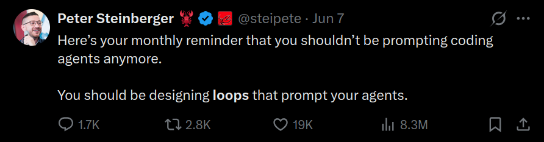

# agentloop — backend-agnostic AI agent orchestration loop for Python

**agentloop** is a lightweight Python framework for multi-agent orchestration. It
implements the **orchestrator → worker → reviewer pattern** (the AI agent
orchestration loop) as a deterministic harness with a closed feedback loop: a goal
is decomposed into subtasks, fanned out to worker subagents, aggregated, and run
through a review gate that loops until the work meets its success criteria. One
loop drives any LLM backend — Anthropic Claude, Claude Code, Codex, opencode, or
aider — through a single `Agent` interface, and it ships as both an **MCP server**
and a plain CLI so any coding agent can call it.

The design principle: **the loop is a harness (deterministic code), not a skill.**
A prompt can *describe* "decompose, review, loop until done" but can't *guarantee*
it. So the control flow lives in code, and the model-facing judgement (how to
decompose, the review rubric) lives in swappable prompts. One harness drives any
backend through a single `Agent` interface.

> 
>
> The tweet that started it all — [Peter Steinberger (@steipete)](https://twitter.com/steipete):
> *"You shouldn't be prompting coding agents anymore. You should be designing **loops**
> that prompt your agents."* agentloop is that idea as a reusable harness.

```
            ┌──────────── harness (this package) ────────────┐
goal ─▶ decompose ─▶ fan-out to subagents ─▶ aggregate ─▶ review gate ─▶ done?
            ▲                                                          │ no
            └──────────────── feedback: refine plan ◀──────────────────┘
```

## Quick start

```bash
python3 -m examples.run_demo        # zero-dependency MockAgent
python3 -m pytest                   # 6 tests, no deps
```

```python
from agentloop import Orchestrator, Budget
from agentloop.adapters import MockAgent

orch = Orchestrator(MockAgent(), budget=Budget(max_iterations=4))
result = orch.run(
    goal="Write a briefing on the orchestrator-worker pattern.",
    success_criteria="Covers decomposition, execution, review, and the feedback loop.",
)
print(result.completed, result.iterations, result.stop_reason)
print(result.final_output)
```

## Use a real model

```bash
pip install -e ".[claude]"
export ANTHROPIC_API_KEY=sk-...
python3 -m examples.run_demo --claude
```

## Plug into any coding agent

The loop is pluggable in two directions, both thin wrappers over the `Agent` seam:

**Inward — coding agents *are* the workers.** `CliAgent` runs each role
(decomposer / subagent / reviewer) through a headless coding-agent CLI, so the
workers get that agent's tools, file access, and repo context:

```python
from agentloop import Orchestrator
from agentloop.adapters import CliAgent

# Point the worker at a repo and let it actually edit files headlessly:
agent = CliAgent.claude_code(cwd="/path/to/repo", skip_permissions=True)
orch = Orchestrator(agent)                     # or .codex() / .opencode() / .aider()
result = orch.run(goal="Add a /health endpoint + test", success_criteria="test passes")
```

Knobs for autonomous coding workers:
- `cwd=...` — run the worker inside a specific repo (works for every preset).
- `skip_permissions=True` — let the worker use tools without prompting
  (`--dangerously-skip-permissions` / `--dangerously-bypass-approvals-and-sandbox` /
  `--yes-always`). Needed for headless coding, but it bypasses all safety prompts —
  point it at a worktree or throwaway branch, not your main checkout.
- `timeout=...` — seconds to cap **each** worker CLI call. **Default is `None`
  (no cap)**: a real coding worker is slow and unpredictable, so a short per-call
  timeout just kills it mid-task and throws the work away. Bound the *run* instead
  with `Budget(max_seconds=...)`, which is checked between iterations.
- `verify_commands=[...]` — run real commands after each worker iteration and feed
  failures back into the next loop. Use this for deterministic checks like
  `python3 -m pytest`, `npm test`, or `npx playwright test`. Any failing verifier
  blocks completion even if the reviewer would otherwise accept the work.

For big builds, keep subgoals small (the worker has to finish one in a single
call) and give the loop room with `max_iterations`; one cold worker can't build
everything in one shot.

Auth piggybacks on the CLI's own login, so a Claude.ai / ChatGPT **subscription
OAuth** session works with no API key.

**Isolated runs.** The safe default for `skip_permissions` is to run inside a
throwaway git worktree on its own branch — your main checkout is never touched:

```python
from agentloop import Orchestrator, worktree
from agentloop.adapters import CliAgent

with worktree("/path/to/repo") as wt:               # new branch + checkout
    agent = CliAgent.claude_code(cwd=wt.path, skip_permissions=True)
    Orchestrator(agent).run(goal="...", success_criteria="...")
    print(wt.changed_files())   # what the run touched
    wt.commit("agentloop run")  # optional: persist on the branch
```

Cleanup mirrors the harness's own worktrees: `cleanup="auto"` (default) **keeps**
the worktree iff the run changed something (so you can inspect/merge the branch)
and removes it if it left nothing; `"always"` / `"never"` force the choice.

**Partial work is never lost.** When you orchestrate against a repo, the loop
**commits the worktree after every iteration** (`agentloop: iteration N`). So if
a later iteration fails or a budget guard stops the run, each completed
iteration's work is preserved as a checkpoint commit on the branch — recoverable,
not discarded. The result's `worktree.checkpoints` lists them. Workers are also
told to **inspect the working directory and continue** from prior work rather
than restart, so a retry builds on what's already there instead of clobbering it.

The example runner isolates automatically when given a repo:

```bash
python3 -m examples.run_with_cli_agent claude /path/to/repo
```

```bash
python3 -m examples.run_with_cli_agent claude   # codex | opencode | aider
```

Custom CLI? It's just a command template (`{prompt}`, `{system}`, `{combined}`;
no prompt placeholder ⇒ text is piped on stdin):

```python
CliAgent(["my-agent", "--system", "{system}", "--ask", "{prompt}"])
```

Presets are starting points — CLI flags vary by version; confirm yours and tweak
`agentloop/adapters/cli.py`. A non-zero exit or timeout becomes a FAILED task
(with retries), not a silent wrong answer.

**Outward — a coding agent *calls* the loop.** An MCP server exposes the loop as a
tool, so any MCP-aware agent (Claude Code, Cursor, Codex, opencode, Cline, Windsurf)
can invoke it. The caller need not be the worker — pick `backend` independently.

```bash
pip install -e ".[mcp]"                # installs the `mcp` SDK
python3 -m agentloop.mcp_server        # stdio transport
```

Tools:
- `orchestrate(goal, success_criteria, backend, cwd, max_iterations, skip_permissions, isolate, model, verify_commands, verify_timeout, detach)`
  — runs the loop; returns either the result or `{ status: "needs_input", questions[], token }`.
  With `detach=true` it returns `{ status: "running", run_id, … }` immediately (see below).
- `orchestrate_resume(token, answers, detach)` — continues a run that asked for input
- `orchestrate_status(run_id)` — light status of a detached run (phase, iteration, running)
- `orchestrate_tail(run_id, cursor, limit)` — the events a detached run produced since `cursor`
- `orchestrate_result(run_id, wait, timeout)` — the final result of a detached run
- `orchestrate_list()` — every detached run this server has started, with status
- `list_backends()` — the worker engines this server can drive
- `doctor(cwd?)` — non-invasive diagnostics for backend CLI availability, target
  directory access, and timeout interpretation

A completed result is structured:
`{ completed, iterations, stop_reason, final_output, summary, history[], worktree? }`
— `summary` is a one-line human-readable digest for the calling agent to show.
While it runs, `orchestrate` streams a `notifications/progress` update when it
starts and after every iteration (e.g. `iteration 2/4: 3/3 subgoals ok, gates
pass, goal incomplete`), so the caller sees live status instead of a bare
spinner.
When `cwd` is given it runs in an isolated worktree (see above) by default.

**Live visibility — don't go blind until it's done.** A blocking `orchestrate`
call hides everything until the whole loop returns. Pass `detach=true` to run it
on a background thread and get a `run_id` back immediately:

```
orchestrate(goal=…, backend="claude_code", cwd="/repo", detach=true)
  -> { status: "running", run_id, run_dir, events_path, tail_command }
orchestrate_tail(run_id, cursor)      -> { events[], cursor, running, more }
orchestrate_status(run_id)            -> { phase, iteration, running, … }
orchestrate_result(run_id, wait=true) -> the final result, once done
```

The calling agent starts the run, then **interleaves polling `orchestrate_tail`
with talking to you** — so you both see the loop work in real time: each subgoal
as it's planned, every worker's start/finish and an output preview, the
verification results, and the reviewer's verdict. Pass the returned `cursor` back
to `orchestrate_tail` to get only what's new.

Every event is also appended to a durable JSONL log you can **`tail -f` from any
terminal**, independent of the agent:

```
<cwd>/.agentloop/runs/<run_id>/
  events.jsonl     # one event per line — tail -f this
  status.json      # latest phase / iteration / running
  result.json      # the final result (written once, at the end)
  workers/         # full stdout of each worker call: iter<N>_<subgoal>.out
```

Worker output previews ride inline in the event stream; each worker's *full*
output is written to `workers/iter<N>_<subgoal>.out` and referenced by
`data.output_path`. Detached runs also sidestep the MCP request-timeout problem
entirely: the tool returns at once, so there's no long-blocking call to time out.

Timeouts have three different layers. The MCP host/client has its own request
timeout; if it reports `-32001 Request timed out`, that often means the host
stopped waiting before `orchestrate` returned, not that a backend failed to
spawn. Configure long-running MCP hosts to wait at least `600000` ms. Separately,
`orchestrate(timeout=...)` is a hard cap for each CLI worker subprocess, while
`max_seconds` is a cooperative loop budget checked between phases/iterations and
does not interrupt one blocked subprocess. Have agents call `doctor()` before
guessing about missing CLIs or broken backend spawning.

**Plug into Claude Code.** Point `PYTHONPATH` at the repo so the server resolves
the package no matter where Claude Code launches it (no install needed):

```bash
claude mcp add athena-loops --scope user \
  -e PYTHONPATH=/abs/path/to/athena-loops \
  -- python3 -m agentloop.mcp_server

claude mcp list                        # -> athena-loops: ✔ Connected
```

Claude Code's CLI registration does not expose a per-server request-timeout flag;
use `doctor()` to distinguish host timeout symptoms from backend availability.

`--scope user` makes it available in every project; use `local` for just this
one, or `project` to write a shared `.mcp.json`. If you `pip install -e .`
instead, the `agentloop-mcp` console script is on PATH and the `-e PYTHONPATH=…`
is unnecessary: `claude mcp add athena-loops -- agentloop-mcp`.

**Plug into Cursor / Cline / Windsurf** (`.mcp.json` / `mcp.json`):

```json
{
  "mcpServers": {
    "athena-loops": {
      "command": "python3",
      "args": ["-m", "agentloop.mcp_server"],
      "env": { "PYTHONPATH": "/abs/path/to/athena-loops" },
      "timeout": 600000
    }
  }
}
```

Then (restart the session first) ask the host agent to "use agentloop to
orchestrate: <goal>", choosing a `backend` (`claude_code`, `codex`, `mock`, …)
for the workers. With `backend=claude_code` the workers spawn nested `claude`
sub-sessions.

For agents that *don't* speak MCP but can run a shell, there's a plain CLI over
the same contract:

```bash
agentloop run --goal "Add a /health endpoint + test" --criteria "test passes" \
  --backend claude_code --cwd . --skip-permissions --json \
  --verify "python3 -m pytest" --verify "npx playwright test"
agentloop backends
```

`--json` prints the full result on stdout; `--progress` streams one NDJSON line
per iteration on stderr; `--goal -` / `--goal-file` read long prompts. `--verify`
is repeatable and runs each command after every iteration in the same repo/worktree
as the worker. Exit code is `0` if completed, `1` if a budget guard stopped it,
`2` on error — so scripts and agents can branch on the outcome.

## How the user gives input (intake & clarification)

Before any planning, the loop runs an **intake** phase: it can propose success
criteria (if you didn't give any) and ask the clarifying questions it needs —
the diagram's "App Follow-up Questions". *Where* the human answers is a second
swappable seam, `Interaction`, mirroring the `Agent` seam:

| Surface | Interaction | UX |
|---|---|---|
| Python / headless (default) | `AutoInteraction` | never blocks; proceeds with best judgment |
| Interactive terminal | `ConsoleInteraction` | prompts the human via `input()` |
| MCP / scripted CLI | `SuspendInteraction` | returns `needs_input` + a resume token instead of blocking |

**Terminal wizard** — omit `--goal` and it asks; criteria and clarifying
questions are prompted inline:

```bash
agentloop run                         # Goal> … then proposes criteria + asks questions
agentloop run --goal "…" --non-interactive   # never prompt; use defaults
```

**Inside another agent (MCP)** — `orchestrate(...)` returns
`{ status: "needs_input", questions: [...], token }` when it needs answers; the
host agent collects them from the user and calls
`orchestrate_resume(token, answers)` to continue. Same flow on the CLI for tools:

```bash
agentloop run --goal "build an API" --ask        # prints questions + token, exits 3
agentloop run --resume <token> --answer "FastAPI" --answer "Postgres"
```

**Python** — pass your own:

```python
from agentloop import Orchestrator, ConsoleInteraction
Orchestrator(agent, interaction=ConsoleInteraction()).run(goal="…")  # criteria optional
```

## The seam (where to put what)

| Layer | Lives in | What it owns |
|-------|----------|--------------|
| **Harness** | `orchestrator.py`, `scheduler.py`, `types.py` | the loop, fan-out, aggregation, review gate, termination guards, failure capture |
| **Agent seam** | `agent.py` + `adapters/` | one `Agent.run(request) -> response` per backend (Mock, Claude, …) |
| **Skills** | `roles.py` | the prompts *inside* each box: decomposer, subagent, reviewer rubric |

To support a new backend, implement one method:

```python
from agentloop.agent import Agent, AgentRequest, AgentResponse

class MyAgent(Agent):
    def run(self, request: AgentRequest) -> AgentResponse:
        text = call_your_model(system=request.system, prompt=request.prompt)
        return AgentResponse(text=text)
```

The three roles (Orchestrator, Subagent, Reviewer) are the *same* `Agent`
invoked with different system prompts — not separate classes.

## Two gaps in the original diagram, handled here

- **Termination guards** — `Budget` caps iterations, wall-clock time, and total
  agent calls so the NO-branch can't spin forever.
- **Subagent failure handling** — a subagent that raises becomes a `FAILED`
  `TaskResult` (with retries), visible to the reviewer and the feedback step,
  instead of crashing the run or being silently dropped.

## Layout

```
agentloop/
  orchestrator.py   # the loop (deterministic harness) — emits live events
  scheduler.py      # parallel/sequential subagent execution + retries
  roles.py          # role prompts — the tunable "skills"
  agent.py          # Agent interface + robust JSON extraction
  types.py          # Budget, Subgoal, TaskResult, ReviewResult, LoopState, LoopEvent, ...
  runs.py           # detached background runs + the tail-able event log
  mcp_server.py     # MCP tools: orchestrate(detach), orchestrate_tail/status/result
  adapters/
    mock.py         # deterministic, dependency-free (demo + tests)
    claude.py       # Anthropic SDK backend
examples/run_demo.py
tests/test_orchestrator.py
```

## FAQ

**What is agentloop?** A backend-agnostic Python framework that implements the AI
agent orchestration loop — the orchestrator–worker–reviewer pattern with a closed
feedback loop — as deterministic harness code rather than a prompt.

**What is the orchestrator–worker–reviewer pattern?** An LLM agent decomposes a
goal into subtasks (orchestrator), parallel worker subagents execute them, and a
reviewer gates the aggregated result against success criteria, looping with
refined plans until done or a budget guard stops it.

**Which LLM backends does agentloop support?** Any model behind a single
`Agent.run()` method. Built-in adapters cover a dependency-free MockAgent, the
Anthropic Claude SDK, and headless coding-agent CLIs — Claude Code, Codex,
opencode, and aider — via `CliAgent`.

**How do I orchestrate multiple coding agents from Claude Code, Cursor, or Cline?**
Run agentloop as an MCP server (`python3 -m agentloop.mcp_server`) and call its
`orchestrate` tool, or use the plain `agentloop run` CLI from any agent that has a
shell.

**Does agentloop need an API key?** No — when you drive it through a coding-agent
CLI it piggybacks on that CLI's own login, so a Claude.ai or ChatGPT subscription
OAuth session works without an `ANTHROPIC_API_KEY`.

**How does agentloop avoid infinite agent loops?** A `Budget` caps iterations,
wall-clock time, and total agent calls, and a failing subagent becomes a `FAILED`
task result (with retries) instead of crashing or silently vanishing.

**Is this like Peter Steinberger Loops / the agent loop technique?** Yes — it's the
same family of idea popularized by Peter Steinberger's writing on running coding
agents in a loop ("Peter Steinberger Loops"). agentloop turns that pattern into a
reusable, backend-agnostic harness with an explicit review gate and budget guards,
rather than a one-off shell script.
